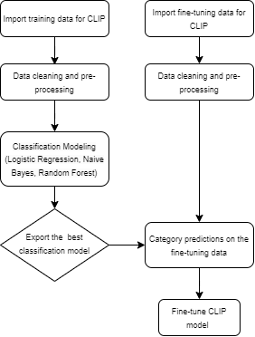

## CLIP_Book_Cover_Generation

### Project Description

This project aims to classify books into related genres and generate book covers using CLIP. We train and adopt a classification model to predict genres for the books in Pyspark, and feed the resulting dataset of book title prompts and predicted genres into CLIP to generate book covers. CLIP is a generative model that creates images based on textual descriptions. The model employs a vanilla transformer to generate embeddings and a vanilla diffusion model to produce images from those embeddings.

The project paper can be found [here](reports/).

### Project Structure

The main method of generating the most closely related images of book covers from the book titles was to add a category description to those titles. That is why, the first part of the project was to find the best-performing classification algorithm that could catch the relationship of the book title and its category. The second part of the project is to use the pre-trained classification model to attach the category description to book covers and fine-tune the ViT-B/32 CLIP model with respective book covers to generate a variety of (image, text) pairs.

### Datasets

+ There are two datasets used in the project; one is used for classification model training and another one for fine-tuning the CLIP model. The first dataset should be rich and large enough to make a good generalization of the relationship between book titles and author names. [The dataset](https://github.com/uchidalab/book-dataset) used for the classification process had 207,572 books from the Amazon.com, Inc. marketplace. After cleaning and pre-processing steps, the dataset size shrunk to around 193,000 books.

+ [The second dataset](https://www.kaggle.com/datasets/lukaanicin/book-covers-dataset) consists of 20,590 book cover images and their titles. The idea is to train the classification algorithm on the first dataset and then apply the model to the second one, which is later used for fine-tuning CLIP and the generation of covers given the book title prompt with the predicted genre.

