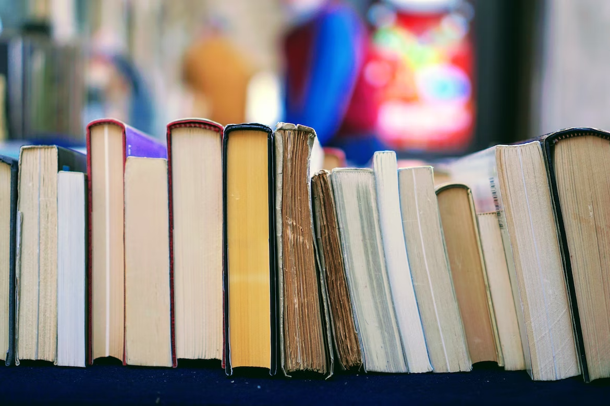

## Fine-Tuning CLIP model with Classified Book Cover Images in PySpark

### Project Description

This project aims to classify books into related genres and generate book covers using CLIP. We train and adopt a classification model to predict genres for the books in Pyspark, and feed the resulting dataset of book title prompts and predicted genres into CLIP to generate book covers. CLIP is a generative model that creates images based on textual descriptions. The model employs a vanilla transformer to generate embeddings and a vanilla diffusion model to produce images from those embeddings.

The project paper can be found [here](reports/).

### Project Structure

The main method of generating the most closely related images of book covers from the book titles was to add a category description to those titles. That is why, the first part of the project was to find the best-performing classification algorithm that could catch the relationship of the book title and its category. The second part of the project is to use the pre-trained classification model to attach the category description to book covers and fine-tune the ViT-B/32 CLIP model with respective book covers to generate a variety of (image, text) pairs.

### Datasets

+ There are two datasets used in the project; one is used for classification model training and another one for fine-tuning the CLIP model. [The first dataset](https://github.com/uchidalab/book-dataset) used for the classification process had 207,572 books from the Amazon.com, Inc. marketplace. After cleaning and pre-processing steps, the dataset size shrunk to around 193,000 books.

  
  

+ [The second dataset](https://www.kaggle.com/datasets/lukaanicin/book-covers-dataset) consists of 20,590 book cover images and their titles. The idea is to train the classification algorithm on the first dataset and then apply the model to the second one, which is later used for fine-tuning CLIP and the generation of covers given the book title prompt with the predicted genre.

  

### Code

Code is split into two parts: [classification](code/classification_part.py) and [CLIP fine-tuning](code/finetuning_part.py).

### Results

We evaluated the feasibility of three classification methods for book genre categorization based on cover images: Naive Bayes, Random Forest, and Logistic Regression. However, all models showed relatively low accuracy, which could be attributed to possible class imbalance and the limited number of genres, leading to underfitting, as well as the fact that book titles often do not directly correspond to the genre they are in. To boost the classification models’ accuracy, future research can focus on addressing these issues. We found that scraping data from websites like amazon.com, Google Books, and Goodreads.com can provide additional features that can help improve the accuracy of the model. If we are able to add more information as a description for each book title, we will be able to increase the accuracy of category prediction. 

For now, we fine-tuned a CLIP model only on a fraction of the data, as an experiment. We only use pairs of book titles with author and book cover images. However, in the future, we plan to use the improved classification model to predict category labels and increase the accuracy of generated CLIP’s similarity scores between book cover images and book titles with author and category information. The final product of this research is supposed to take a new book title prompt and its category and be able to generate a book cover image based on the similarity scores between the prompt and its training data.

