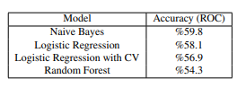

## Classification model

This step consisted of researching the best classification technique. The models tested included: Logistic Regression, Naive Bayes, and Random Forest. After performing cross-cross validation on all three, the best configurations were chosen and are present in the table below.



From the table above, the model with the highest performance is the Naive Bayes. The low accuracy on all the models indicates that there is a weak correlation between a book’s title and its category, which makes sense in real life. Some books’ titles do not give any clues about the category they belong to. However, since it is a hard task even for a human brain, we believe that this approximation is still enough to make a good guess about a book’s category based on its title. We will use the pre-trained Naive Bayes model to make category predictions for the book title prompts in the second dataset used for fine-tuning the model.


### Exploring classification models to find the best one:

Install PySpark:
```
%%bash
pip install pyspark &> /dev/null
```

Import statements here and create spark and sparkcontext objects
```
from pyspark.sql import SparkSession
from pyspark.sql import SQLContext
from pyspark.sql import Row
import numpy as np
import pandas as pd
spark = SparkSession.builder.getOrCreate()
sc = spark.sparkContext

sqlContext = SQLContext(sc)
```
```
import pandas as pd
import datetime as dt
import matplotlib.pyplot as plt
from matplotlib import pyplot as plt
from matplotlib import rcParams
import seaborn as sns
import re

from pyspark.sql.functions import *
```


