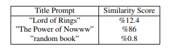

## Fine-tuning CLIP

With the dataset of pairs of images and book titles with predicted categories, we built the pipeline to transform and feed data into a pre-trained CLIP model to fine-tune for the task of relating book cover images and book titles with categories. Since CLIP is a large model and works with visual data, we utilize [PySpark’s TorchDistributor package](https://spark.apache.org/docs/latest//api/python/reference/api/pyspark.ml.torch.distributor.TorchDistributor.html) to create a series of TorchDistriubutor objects and parallelize the fine-tuning (training) process of the CLIP model. It allows us to save computational resources and fine-tune the model on large-scale data.

In the figure above, we use the example book cover and generate a few book title prompts to test for similarity with the book cover. From the table above, we can see that the closest title is estimated to be ”The Power of Nowww” which almost says the same thing as the actual book cover, and the model is able to understand the similarity. In the future, if we add a predicted category to each prompt and fine-tune the model again, we will be able to increase the similarity scores.
